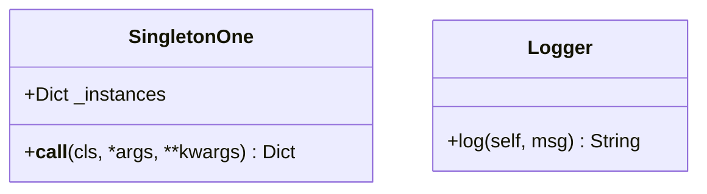
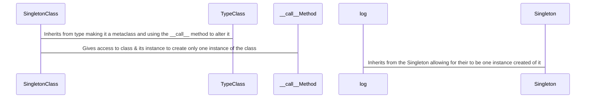
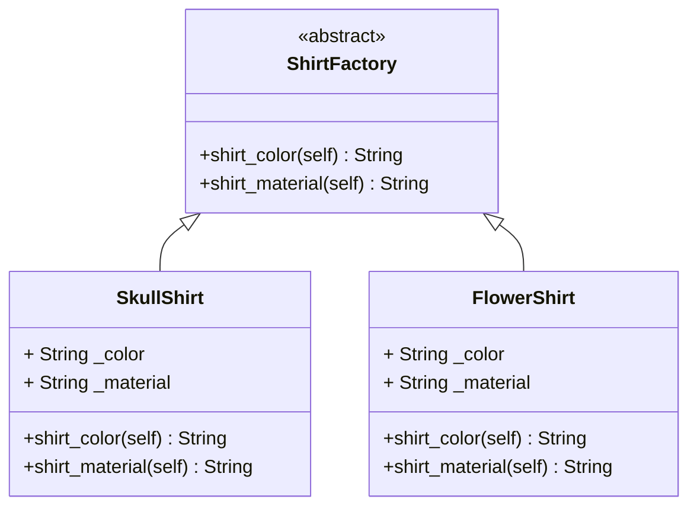

# Your Fun Guide to Design Patterns: A Beginner’s Adventure in Programming!
https://refactoring.guru/design-patterns/what-is-pattern
## What Are Design Patterns?

Patterns are typical solutions to common problems in object-oriented design. When a
solution gets repeated over and over in various projects, someone eventually puts 
name to it and describes the solution in detail.

The pattern is not a specific piece of code, but a general concept for
solving a particular problem. You can follow the pattern details and implement
a solution that suits the realities of your own program.

You might manage to work as a programmer for many years without knowing about a
single pattern. A lot of people do just that. Even in that case, though, you might
be implementing some patterns without even knowing it. So why would you spend time
learning them?

- Design patterns are a toolkit of tried and tested solutions to common problems
in software design. Even if you never encounter these problems, knowing patterns
is still useful because it teaches you how to solve all sorts of problems using
principles of object-oriented design.

- Design patterns define a common language that you and your teammates can use to
communicate more efficiently.

We’ll explore **30 popular design patterns**, grouped into three big families:
**Creational** (making objects), **Structural** (organizing objects), and **Behavioral**
(how objects talk to each other).

Plus, we’ll talk about **generic programming** (making code work with any type
of data, like numbers or words) and **clean code** (writing code that’s clear and easy to read).

For each pattern, you’ll get:
- **What is it?**: A simple explanation.
- **Why use it?**: Why it’s cool for your projects.
- **How it works?**: A step-by-step breakdown with a fun analogy.
- **Pseudocode**: Easy-to-follow steps in plain English (no Python code—you’ll write
that yourself!).
- **When to use it**: When this pattern saves the day.
- **Clean Code Tips**: Tricks to make your code neat and professional.
- **Generic Programming**: How to make the pattern flexible for any data type.

Ready? Let’s dive into this coding adventure!

---

The most basic and low-level patterns are often called idioms. They usually apply
only to a single programming language. The most universal and high-level patterns
are architectural patterns. Developers can implement these patterns in virtually
any language.

In addition, all patterns can be categorized by their intent, or purpose. There
are three main types of design patterns:

1. **Creational**: Provide object creation mechanisms that increase
flexibility and reuse of existing code.
2. **Structural**: Explain how to assemble objects and classes into larger structures,
while keeping these structures flexible and efficient.
3. **Behavioral**: Take care of effective communication and the assignment of
responsibilities between objects.

We’ll cover **10 patterns in each category**, making a total of 30. Don’t worry if some sound
fancy—they’re all super approachable once we break them down!

---

## Creational Design Patterns: Making Objects the Smart Way
Creational patterns are all about creating objects. These patterns make
sure you create objects in a flexible, reusable way.

### 1. Singleton
- **What is it?**: Ensure that a class has just a single instance. If
you decided to create a new version of this object you would get the
object that you've already created.

- **Why use it?**: Saves memory and prevents confusion by having just
one instance(e.g., one settings manager for your app). Protects that
instance from being overwritten by other code.

You don’t want the code that solves problem #1 to be scattered all over 
your program. It’s much better to have it within one class, especially
if the rest of your code already depends on it.

- **Implementations of singleton have these steps in common**:
  1. Make the default constructor private, to prevent other objects
  from using the new operator with the Singleton class.
  
  2. Create a static creation method that acts as a constructor. Under
  the hood, this method calls the private constructor to create an
  object and saves it in a static field. All following calls to this
  method return the cached object.
  
- **How it works?**:
  1. Create a class that holds the single object.
  2. Make a method to get that object.
  3. If the object doesn’t exist, create it; otherwise, return the
  existing one.
  
- **Analogy**: Imagine a school with one principal. Everyone goes to
the same principal for decisions, and there’s never a second one.

- **Pseudocode**:
  ```
  Singleton:
      If no instance exists:
          Create new instance
      Return the instance
  ```
  
- **When to use it**: When you need exactly one object, like a game’s
music player or a log file.

- **Clean Code Tips**:
  - Use clear names like `GameSettings` for the singleton class.
  - Avoid overusing singletons—they can make testing tricky.
  
- **Generic Programming**: Make the singleton hold any type of data
(e.g., settings could be numbers, text, or lists).

- **Class Diagram**:


- **Sequence Diagram**:


### 2. Factory Method
- **What is it?**: Provides a certain group of methods for creating
objects in a superclass, but allows subclasses to inherit from said
class and alter the type of objects that will be created. 

- **Why use it?**: Lets you add new object types easily without changing
old code.

- **How it works?**:
  1. Define a method that creates objects.
  2. Subclasses decide which type of object to make.
  3. Call the method to get the object.
  
- **Analogy**: At a pizza shop, you order a “pizza,” and the chef decides
if it’s cheese or pepperoni based on the order.

- **Pseudocode**:
  ```
  FactoryMethod:
      Define create_object method
      Subclass overrides create_object to make specific object
      Call create_object to get object
  ```

- **When to use it**: When you have different types of objects
(e.g., enemies in a game) and want to create them flexibly.

- **Clean Code Tips**:
  - Name methods clearly (e.g., `createEnemy`).
  - Keep the factory simple and focused on creating objects.
  
- **Generic Programming**: Allow the factory to create objects of any
type by using a common interface.

- **Class Diagram**:


### 3. Abstract Factory
- **What is it?**: provides a certain group of methods for creating
objects in a superclass, but allows subclasses to inherit from said
class and alter the type of objects that will be created, However
the superclass cannot be implemented because it is abstract.

- **Structure of Abstract factory**:
1. Abstract Products declare interfaces for a set of distinct but
related products which make up a product family.
2. Concrete Products are various implementations of abstract products,
grouped by variants. Each abstract product (chair/sofa) must be
implemented in all given variants (Victorian/Modern).
3. The Abstract Factory interface declares a set of methods for
creating each of the abstract products.
4. Concrete Factories implement creation methods of the abstract
factory. Each concrete factory corresponds to a specific variant
of products and creates only those product variants.
5. Although concrete factories instantiate concrete products, signatures
of their creation methods must return corresponding abstract products.
This way the client code that uses a factory doesn’t get coupled to
the specific variant of the product it gets from a factory. The Client
can work with any concrete factory/product variant, as long as it
communicates with their objects via abstract interfaces.

- **Why use it?**: Ensures objects work together (e.g., all game
characters match the game’s theme).

- **How it works?**:
  1. Define a factory with methods to create different objects.
  2. Create specific factories for different groups (e.g., medieval
  or sci-fi themes).
  3. Use the factory to get all objects.
  
- **Analogy**: A car factory makes engines, wheels, and seats that all
fit together for a sports car or a truck.

- **Pseudocode**:
  ```
  AbstractFactory:
      Define methods to create object1, object2, etc.
      Create specific factory for group A
      Create specific factory for group B
      Use factory to get matching objects
  ```
  
- **When to use it**: When you need families of objects, like UI elements
for different app themes.

- **Clean Code Tips**:
  - Use descriptive names for factories (e.g., `MedievalCharacterFactory`).
  - Avoid adding unrelated objects to the factory.
  
- **Generic Programming**: Design the factory to work with any object 
type using interfaces.

### 4. Builder
- **What is it?**: lets you construct complex objects step by step,
by assembling in a form of dependency.

The Builder pattern suggests that you extract the object construction
code out of its own class and move it to separate objects called
builders. The pattern organizes object construction into a set of steps.

You can create several different builder classes that implement the same
set of building steps, but in a different manner. Then you can use these
builders in the construction process (i.e., an ordered set of calls to
the building steps) to produce different kinds of objects.

- **Director**: ou can go further and extract a series of calls to the
builder steps you use to construct a product into a separate class
called director. The director class defines the order in which to
execute the building steps, while the builder provides the implementation
for those steps. Having a director class in your program isn’t
strictly necessary.

- **Structure**: 
1. The Builder interface declares product construction
steps that are common to all types of builders.

2. Concrete Builders provide different implementations of the construction
steps. Concrete builders may produce products that don’t follow the common
interface.

3. Products are resulting objects. Products constructed by different
builders don’t have to belong to the same class hierarchy
or interface.

4. The Director class defines the order in which to call construction steps,
so you can create and reuse specific configurations of products.

5. The Client must associate one of the builder objects with the director.
Usually, it’s done just once, via parameters of the director’s constructor.
Then the director uses that builder object for all further construction. However,
there’s an alternative approach for when the client passes the builder object
to the production method of the director. In this case, you can use a different
builder each time you produce something with the director.

- **Why use it?**: Makes it easy to create objects with lots of options
without messy code.

- **How it works?**:
  1. Create a builder with methods to set parts of the object.
  2. Call these methods to customize the object.
  3. Get the final object when done.
  
- **Analogy**: Building a Lego castle by adding walls, towers, and
flags one piece at a time.

- **Pseudocode**:
  ```
  Builder:
      Create builder
      Set part1
      Set part2
      Build final object
  ```
- **When to use it**: When objects have many parts, like a game
character with weapons, armor, and skills.

- **Clean Code Tips**:
  - Name methods clearly (e.g., `addWeapon`).
  - Make the builder easy to read with a clear build process.
  
- **Generic Programming**: Allow the builder to create objects of any
type by defining a common structure.

### 5. Prototype
- **What is it?**: Copies existing objects and allowing you to make changes to said
copy(known as the prototype) for the purpose of finding the best version of it.

- **Why use it?**: To find the best version of the product or service your building.

- **How it works?**:
  1. Create an object you want to copy.
  2. Make a method to clone it.
  3. Use the clone to make new objects.
  
- **Analogy**: Using a cookie cutter to make identical cookies from one dough.

- **Pseudocode**:
  ```
  Prototype:
      Create original object
      Define clone method
      Call clone to make new object
  ```
  
- **When to use it**: When copying is easier than creating, like duplicating
game items.

- **Clean Code Tips**:
  - Ensure clones are independent (changes to one don’t affect others).
  - Use clear names like `cloneCharacter`.
  
- **Generic Programming**: Make the clone method work with any object type.

### 6. Object Pool
- **What is it?**: Contains reusable objects that can be borrowed when
needed(for example it could contain design patterns).

- **Why use it?**: Saves time and memory by reusing objects, like reusing bullets
in a shooting game.

- **How it works?**:
  1. Create a pool of objects.
  2. Borrow an object when needed.
  3. Return it to the pool when done.
  
- **Analogy**: A car rental service where you borrow a car, use it, and return it for
someone else.

- **Pseudocode**:
  ```
  ObjectPool:
      Create pool with objects
      Get object from pool
      Use object
      Return object to pool
  ```
- **When to use it**: When creating objects is slow, like loading game sprites.

- **Clean Code Tips**:
  - Keep the pool simple with clear get/return methods.
  - Ensure returned objects are reset for reuse.
  
- **Generic Programming**: Allow the pool to hold any object type.

### 7. Dependency Injection
- **What is it?**: Satisfy any requirement for your code using a package from the
outside, like handing a chef their ingredients.

- **Why use it?**: Makes code flexible and easy to test by swapping tools.

- **How it works?**:
  1. Define an object that needs tools.
  2. Pass the tools when creating the object.
  3. Use the tools inside the object.
  
- **Analogy**: A painter gets their brushes and paint from you instead of making them.

- **Pseudocode**:
  ```
  DependencyInjection:
      Define object needing tool
      Pass tool to object
      Object uses tool
  ```

- **When to use it**: When you want to change tools easily, like switching databases
in an app.

- **Clean Code Tips**:
  - Use clear names for tools (e.g., `databaseService`).
  - Avoid passing too many tools.
  
- **Generic Programming**: Use interfaces to allow any tool type.

### 8. Lazy Initialization
- **What is it?**: Initializes objects without the __init__ method, but only when an
instance of the class is made, using the __post_init__ method.

- **Why use it?**: Saves memory and time by delaying work.

- **How it works?**:
  1. Check if the object exists.
  2. If not, create it.
  3. Return the object.
  
- **Analogy**: You don’t set up a picnic until your friends arrive.

- **Pseudocode**:
  ```
  LazyInitialization:
      If object is null:
          Create object
      Return object
  ```

- **When to use it**: When objects are heavy (like loading a big image) and might not be used.

- **Clean Code Tips**:
  - Name the method clearly (e.g., `getImage`).
  - Ensure thread safety if multiple users access it.
  
- **Generic Programming**: Make the lazy object hold any type.

### 9. Multiton
- **What is it?**: Like a singleton but allows a limited number of objects, like having one
manager per department.

- **Why use it?**: Controls multiple unique instances, like one connection per user.

- **How it works?**:
  1. Store a set of objects with keys (e.g., department names).
  2. Return the object for a key or create a new one if needed.
  
- **Analogy**: A keychain with one key per door, but only one key per door exists.

- **Pseudocode**:
  ```
  Multiton:
      If key not in instances:
          Create new instance for key
      Return instance for key
  ```
  
- **When to use it**: When you need a few unique objects, like database connections.

- **Clean Code Tips**:
  - Use clear key names (e.g., `userId`).
  - Limit the number of instances to avoid confusion.
  
- **Generic Programming**: Allow instances to hold any data type.

### 10. Resource Acquisition Is Initialization (RAII)
- **What is it?**: Ties resource use(RAM) to an object’s life(Programs), like automatically
closing a book when you’re done reading.

- **Why use it?**: Prevents resource leaks (e.g., forgetting to close a file).

- **How it works?**:
  1. Create an object that grabs a resource (e.g., opens a file).
  2. Use the resource.
  3. When the object is destroyed, the resource is released.
  
- **Analogy**: A smart lunchbox that cleans itself when you’re done eating.

- **Pseudocode**:
  ```
  RAII:
      Create object and acquire resource
      Use resource
      Destroy object to release resource
  ```
  
- **When to use it**: When managing resources like files or network connections.

- **Clean Code Tips**:
  - Keep resource handling simple and automatic.
  - Name objects clearly (e.g., `FileHandler`).
  
- **Generic Programming**: Allow the resource to be any type (e.g., file, database).

---

## Structural Design Patterns: Organizing Objects Like a Pro

Structural patterns help you arrange objects so they work together smoothly, like
organizing furniture in a room for easy movement.

### 11. Adapter
- **What is it?**: Makes two incompatible objects work together, like a plug adapter for
different outlets.

- **Why use it?**: Lets you use old or external code with your new code.

- **How it works?**:
  1. Create an adapter that understands both objects.
  2. Translate calls from one to the other.
  3. Use the adapter to connect them.
  
- **Analogy**: A translator helping two people speak different languages.

- **Pseudocode**:
  ```
  Adapter:
      Create adapter for old object
      Translate new method to old method
      Call old method
  ```
- **When to use it**: When integrating a library with different methods, like a game
using an old graphics tool.

- **Clean Code Tips**:
  - Name the adapter clearly (e.g., `OldGraphicsAdapter`).
  - Keep translations simple and focused.
  
- **Generic Programming**: Make the adapter work with any object type.

### 12. Bridge
- **What is it?**: Separates an object’s interface from its implementation, like a
remote control that works with any TV brand.

- **Why use it?**: Lets you change how things work without changing how they’re used.

- **How it works?**:
  1. Define an interface for the object.
  2. Create implementations for different behaviors.
  3. Connect the interface to an implementation.
  
- **Analogy**: A light switch that works with any bulb type (LED, fluorescent).

- **Pseudocode**:
  ```
  Bridge:
      Define interface with method
      Create implementation A
      Create implementation B
      Use interface with chosen implementation
  ```

- **When to use it**: When you want flexibility, like supporting multiple databases in
an app.

- **Clean Code Tips**:
  - Use clear names for interfaces and implementations.
  - Keep the bridge focused on one job.
  
- **Generic Programming**: Allow implementations for any data type.

### 13. Composite
- **What is it?**: A Composite has a part-whole relationship, where the whole object is
made up off parts.

- **Why use it?**: Simplifies code for tree-like structures, like a game’s scene with
objects and groups.

- **How it works?**:
  1. Define a common interface for single and group objects.
  2. Single objects do their job.
  3. Group objects pass the job to their children.
  
- **Analogy**: A music playlist that can have songs or other playlists.

- **Pseudocode**:
  ```
  Composite:
      Define interface with method
      Single object implements method
      Group object calls method on all children
  ```
  
- **When to use it**: When you have hierarchies, like menus or game levels.

- **Clean Code Tips**:
  - Use consistent method names across objects.
  - Keep groups and singles simple.
  
- **Generic Programming**: Allow the composite to hold any object type.

### 14. Decorator
- **What is it?**: See the inner workings of a class and adds features to an object
without changing it, like adding toppings to a pizza.(example: @log_decorator)

- **Why use it?**: Lets you extend objects flexibly without modifying their code.

- **How it works?**:
  1. Create a decorator that wraps an object.
  2. Add new features in the decorator.
  3. Use the decorated object.
  
- **Analogy**: Dressing up a plain T-shirt with stickers or patches.

- **Pseudocode**:
  ```
  Decorator:
      Create decorator wrapping object
      Add new feature
      Call original object’s method
  ```

an interface connects one object to another
  
- **When to use it**: When adding features, like extra game character abilities.

- **Clean Code Tips**:
  - Name decorators clearly (e.g., `SpeedBoostDecorator`).
  - Keep decorators focused on one feature.
  
- **Generic Programming**: Allow decorators to wrap any object type.

### 15. Facade
- **What is it?**: Simplifies a complex system with a single interface, like a TV remote
controlling a whole home theater.

- **Why use it?**: Makes complicated code easy to use.

- **How it works?**:
  1. Create a facade with simple methods.
  2. Facade calls the complex system’s methods.
  3. Use the facade to interact with the system.
  
- **Analogy**: A restaurant menu that hides the kitchen’s complexity.

- **Pseudocode**:
  ```
  Facade:
      Create facade with simple method
      Facade calls complex system methods
      Use facade method
  ```

- **When to use it**: When dealing with complex libraries, like a game engine.

- **Clean Code Tips**:
  - Keep facade methods short and clear.
  - Avoid adding unnecessary logic to the facade.
  
- **Generic Programming**: Make the facade work with any system type.

### 16. Flyweight
- **What is it?**: Shares similar objects to different classes(by inheritance) each
object in a class includes different unique functionalities that can be shared, like
using one tree graphic for all trees in a game.

- **Why use it?**: Reduces the amount of memory and processing you use

- **How it works?**:
  1. Create a flyweight factory to manage shared objects.
  2. Store shared data in flyweights.
  3. Use flyweights with unique data as needed.
  
- **Analogy**: A library sharing one copy of a book with many readers.

- **Pseudocode**:
  ```
  Flyweight:
      Create factory for shared objects
      Get shared object from factory
      Use object with unique data
  ```
  
- **When to use it**: When you have many similar objects, like game sprites.

- **Clean Code Tips**:
  - Name flyweights clearly (e.g., `TreeGraphic`).
  - Keep shared data minimal.
  
- **Generic Programming**: Allow flyweights to hold any shared data type.

### 17. Proxy
- **What is it?**: reroutes you to the service your looking(without giving you direct access
to it), like a security guard checking who enters a building.

- **Why use it?**: Adds control, like lazy loading or permission checks.

- **How it works?**:
  1. Create a proxy that mimics the real object.
  2. Proxy decides when to call the real object.
  3. Use the proxy instead of the object.
  
- **Analogy**: A ticket booth that checks your pass before letting you into a concert.

- **Pseudocode**:
  ```
  Proxy:
      Create proxy for real object
      Proxy checks conditions
      Proxy calls real object if allowed
  ```
- **When to use it**: When you need to control access, like loading images only when needed.

- **Clean Code Tips**:
  - Name proxies clearly (e.g., `ImageProxy`).
  - Keep proxy logic simple.
- **Generic Programming**: Allow the proxy to control any object type.

### 18. Marker Interface
- **What is it?**: An empty interface that marks objects, providing run-time type information
about them, like a VIP badge that says you’re special.

- **Why use it?**: Lets you identify objects for special treatment without adding code.

- **How it works?**:
  1. Define an empty interface.
  2. Objects implement the interface.
  3. Check for the interface to apply special rules.
  
- **Analogy**: A “staff only” badge that lets you into certain rooms.

- **Pseudocode**:
  ```
  MarkerInterface:
      Define empty interface
      Object implements interface
      Check if object has interface
  ```
  
- **When to use it**: When you need to tag objects, like marking game items as “collectible.”

- **Clean Code Tips**:
  - Use clear interface names (e.g., `Collectible`).
  - Avoid overusing markers.
  
- **Generic Programming**: Apply the marker to any object type.

### 19. Module
- **What is it?**: Groups related code into a single unit, like a toolbox holding all your tools.

- **Why use it?**: Keeps code organized and easy to find.

- **How it works?**:
  1. Create a module with related functions or objects.
  2. Import the module to use its contents.
  
- **Analogy**: A kitchen drawer with all your cooking utensils in one place.

- **Pseudocode**:
  ```
  Module:
      Define module with functions/objects
      Import module
      Use module contents
  ```
  
- **When to use it**: When organizing code, like grouping game utilities.

- **Clean Code Tips**:
  - Name modules clearly (e.g., `GameUtils`).
  - Keep modules focused on one purpose.
  
- **Generic Programming**: Allow module contents to work with any data type.

### 20. Private Class Data
- **What is it?**: Hides an object’s data to protect it, like locking your diary,
so only you can write in it.
- **Why use it?**: Prevents accidental changes to important data.
- **How it works?**:
  1. Store data in private fields.
  2. Use methods to access or change data.
  3. Keep data safe from outside code.
- **Analogy**: A safe where only you have the key to access valuables.
- **Pseudocode**:
  ```
  PrivateClassData:
      Define class with private data
      Provide methods to get/set data
      Use methods to access data
  ```
- **When to use it**: When you want to protect data, like a player’s score.
- **Clean Code Tips**:
  - Use clear method names (e.g., `getScore`).
  - Keep private data minimal.
- **Generic Programming**: Allow private data to be any type.
# TODO: Marker Interface, Module, Private Class Data

---

## Behavioral Design Patterns: Helping Objects Work Together

Behavioral patterns focus on how objects communicate, like teammates passing a
ball in a game.

### 21. Chain of Responsibility
- **What is it?**: Passes a request along a chain of objects in a sequence that
either determine whether the request is True or false(can be processed or passed
to the next), like a customer service line transferring your call.

- **Why use it?**: Keeps objects independent while handling requests flexibly.

- **How it works?**:
  1. Create a chain of objects, each with a handler.
  2. Pass the request to the first object.
  3. Each object either handles it or passes it to the next.
  
- **Analogy**: A relay race where each runner passes the baton until someone
finishes.

- **Pseudocode**:
  ```
  ChainOfResponsibility:
      Create chain of handlers
      Pass request to first handler
      Handler processes or passes to next
  ```
  
- **When to use it**: When your program is expected to process different kinds of
requests in various ways

- **Clean Code Tips**:
  - Name handlers clearly (e.g., `InputHandler`).
  - Keep the chain simple.
  
- **Generic Programming**: Allow handlers to process any request type.

### 22. Command
- **What is it?**: Turns a request into an object that contains information about the request,
like saving a game move to redo it later.

- **Why use it?**: Lets you undo, redo, or queue actions.

- **How it works?**:
  1. Create a command object with an action.
  2. Execute the command when needed.
  3. Store commands for undo/redo.
  
- **Analogy**: A remote control button that stores an action like “turn on TV.”

- **Pseudocode**:
  ```
  Command:
      Create command with action
      Execute command
      Store command for undo/redo
  ```

- **When to use it**: When you need undo/redo, like in a drawing app.

- **Clean Code Tips**:
  - Name commands clearly (e.g., `MoveCommand`).
  - Keep commands focused on one action.
  
- **Generic Programming**: Allow commands to handle any action type.

### 23. Interpreter
- **What is it?**: Defines a series of symbols or context and convert it to an
action, like translating game commands into actions.

- **Why use it?**: Makes it easy to process custom rules or scripts.

- **How it works?**:
  1. Define a grammar for the language.
  2. Create objects to interpret each rule.
  3. Process input using the objects.
  
- **Analogy**: A translator turning your game script into actions.

- **Pseudocode**:
  ```
  Interpreter:
      Define grammar rules
      Create interpreters for rules
      Process input with interpreters
  ```

- **When to use it**: When creating a scripting language, like game mods.

- **Clean Code Tips**:
  - Keep grammar simple and clear.
  - Name interpreters clearly (e.g., `MoveInterpreter`).
  
- **Generic Programming**: Allow interpreters to process any input type.

### 24. Iterator
- **What is it?**: lets you traverse elements of a collection without exposing how
there stored (list, stack, tree, etc.), like flipping through a photo album.

- **Why use it?**: Simplifies accessing collections, like game items.

- **How it works?**:
  1. Create an iterator with methods to get the next item.
  2. Use the iterator to loop through items.
  
- **Analogy**: A TV remote that moves to the next channel without you knowing how.

- **Pseudocode**:
  ```
  Iterator:
      Create iterator for collection
      While has next item:
          Get next item
  ```
  
- **When to use it**: When looping through lists, like game scores.

- **Clean Code Tips**:
  - Name iterators clearly (e.g., `ItemIterator`).
  - Keep iteration logic simple.
  
- **Generic Programming**: Allow iterators to work with any item type.

### 25. Mediator
- **What is it?**: A central object that manages communication and if an object
isn't function the way its meant to a message would be sent to the mediator to
deal with it, like a chat group admin coordinating messages.

- **Why use it?**: Reduces messy connections between objects.

- **How it works?**:
  1. Create a mediator to handle messages.
  2. Objects send messages to the mediator.
  3. Mediator routes messages to the right objects.
  
- **Analogy**: A traffic light controlling cars at an intersection.

- **Pseudocode**:
  ```
  Mediator:
      Create mediator
      Objects send messages to mediator
      Mediator routes messages
  ```
  
- **When to use it**: When objects talk a lot, like game players chatting.

- **Clean Code Tips**:
  - Name mediators clearly (e.g., `ChatMediator`).
  - Keep mediation logic focused.
  
- **Generic Programming**: Allow mediators to handle any message type.

### 26. Memento
- **What is it?**: Saves an objects data until it is called by the client
to be used, like a game’s save point.

- **Why use it?**: Lets you undo changes or save progress.

- **How it works?**:
  1. Create a memento to store the object’s state.
  2. Save the memento.
  3. Restore the state from the memento.
  
- **Analogy**: A bookmark in a book to return to your place.

- **Pseudocode**:
  ```
  Memento:
      Create memento with object’s state
      Save memento
      Restore state from memento
  ```
  
- **When to use it**: When you need to save/restore, like game progress.

- **Clean - **Clean Code Tips**:
  - Name mementos clearly (e.g., `GameStateMemento`).
  - Keep memento data minimal.
  
- **Generic Programming**: Allow mementos to store any state type.

### 27. Observer
- **What is it?**: Notifies objects when something changes, like a news app
sending alerts.

- **Why use it?**: Keeps objects updated without tight connections.

- **How it works?**:
  1. Create a subject that holds observers.
  2. Observers subscribe to the subject.
  3. Subject notifies observers of changes.
  
- **Analogy**: A group chat where everyone gets a message when someone
posts.

- **Pseudocode**:
  ```
  Observer:
      Create subject
      Add observers to subject
      Subject notifies observers of change
  ```
- **When to use it**: When objects need updates, like UI elements in a game.
- **Clean Code Tips**:
  - Name observers clearly (e.g., `ScoreObserver`).
  - Avoid over-notifying.
- **Generic Programming**: Allow observers to handle any event type.

### 28. State
- **What is it?**: Changes an object’s behavior based on its state, like a
traffic light changing colors.

- **Why use it?**: Keeps state-specific code organized.

- **How it works?**:
  1. Define states with behaviors.
  2. Object switches between states.
  3. Each state handles actions differently.
  
- **Analogy**: A vending machine that behaves differently when out of
stock.

- **Pseudocode**:
  ```
  State:
      Define states with behaviors
      Object sets current state
      State handles actions
  ```
  
- **When to use it**: When behavior changes, like a game character’s modes.

- **Clean Code Tips**:
  - Name states clearly (e.g., `IdleState`).
  - Keep state transitions clear.
  
- **Generic Programming**: Allow states to handle any behavior type.

### 29. Strategy
- **What is it?**: Swaps algorithms at runtime, like choosing a sorting
method.

- **Why use it?**: Makes algorithms interchangeable.

- **How it works?**:
  1. Define a strategy interface.
  2. Create different strategies.
  3. Object uses a strategy to perform a task.
  
- **Analogy**: A chef picking a recipe for a dish.

- **Pseudocode**:
  ```
  Strategy:
      Define strategy interface
      Create strategy A
      Create strategy B
      Object uses chosen strategy
  ```

- **When to use it**: When you need flexibility, like sorting game scores.

- **Clean Code Tips**:
  - Name strategies clearly (e.g., `QuickSortStrategy`).
  - Keep strategies focused on one task.
  
- **Generic Programming**: Allow strategies to work with any data type.

### 30. Template Method
- **What is it?**: Defines a skeleton for an algorithm to follow where it
can override specific steps of the algorithm without changing its structure,
letting subclasses fill in details, like a recipe with customizable steps.

- **Why use it?**: Use the Template Method pattern when you want to let clients
extend only particular steps of an algorithm, but not the whole algorithm or its
structure.

- **How it works?**:
  1. Define a method with fixed steps.
  2. Allow subclasses to override specific steps.
  3. Call the method to run the algorithm.
  
- **Analogy**: A cake recipe where you choose the frosting flavor.

- **Pseudocode**:
  ```
  TemplateMethod:
      Define method with steps
      Subclass overrides specific steps
      Call method to run algorithm
  ```
  
- **When to use it**: When algorithms share steps, like processing game levels.

- **Clean Code Tips**:
  - Name the template method clearly (e.g., `processLevel`).
  - Keep the skeleton simple.
  
- **Generic Programming**: Allow customizable steps to handle any data type.

### S.O.L.I.D
## Single Responsibility Principle
Definition: Classes that are responsible for a single thing and thus making it reusable

## Open/Closed Principle
Definition: Classes that are open for extension, meaning to extend said existing code
for more functionality.(You shouldn't need to modify existing code to do this.)

## Liskov Substitution Principle
Definition: If there are objects in your class you should be able to replace them with
instances of subclasses and subtypes(without altering the correctness of the program.)

## Interface Segregation Principle
Definition: You have several separate interfaces as apposed to having one general
purpose interface.

## Dependency Inversion
Definition: When a class depends on abstractions and not concrete subclasses.

---

## Keep Exploring!

Wow, you made it through 30 design patterns—you’re a coding rockstar! These patterns are like
tools in your programming toolbox, ready to help you build awesome apps, games, or websites. Try
implementing them in Python as practice (start with something simple like Singleton or Factory).
Don’t worry if it feels tricky at first—every coder starts somewhere, and you’re already on your way!

Experiment, make mistakes, and have fun. Search online for examples, ask questions, and keep coding.
You’ve got this!